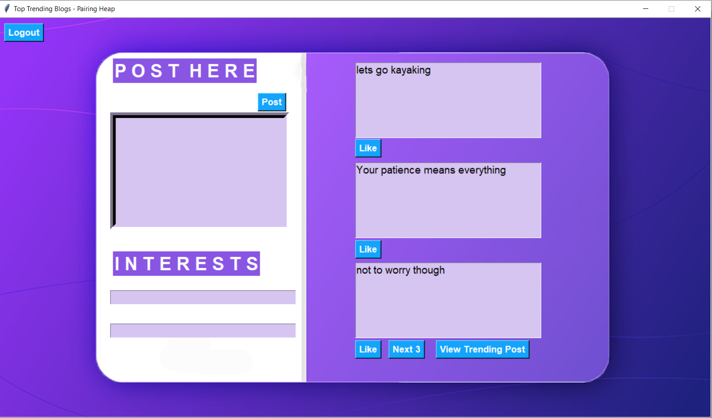
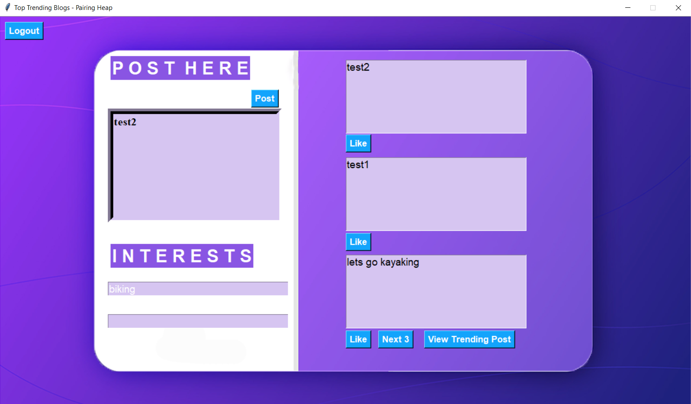
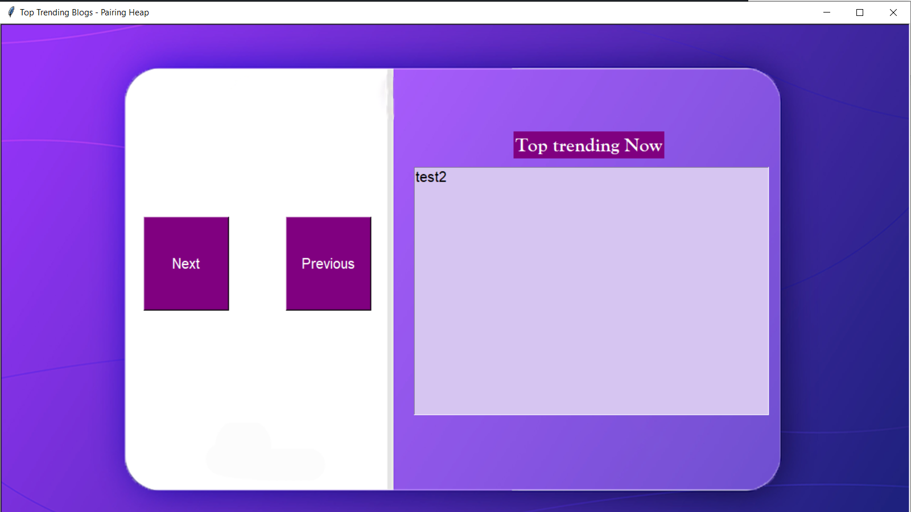
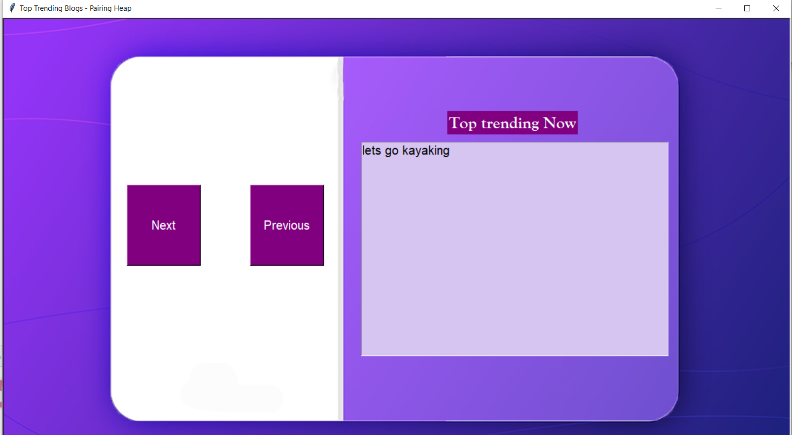

# CS201 - Data Structures - Social Media Analyser (Pairing heap)

This repository is a final project submission for the DS2 spring 2022 offering at Habib University.


## Introduction
Social Media forms a huge part of our entertainment and daily communication. Facebook, twitter and all other major social media apps have incorporated the top trending feature whose intention is to show the  top liked few posts at the time, understandably this can be done using a priority queue or heap whose priority is the number of likes. It is also true that most users are there on the top trending are interested only in the few of the very top messages making a priority heap with consecutive pop min operations even more relevant.  Since the likes frequently change and need to be updated constantly, the decrease key function will be a frequent operation in the structure and since the main strength of out pairing heap structure is its quick decrease key operation. It forms a perfect choice for our top trending back end implementation which we have used.


## Flow and App Structure 

Note our main code is in the login.py file , which is our main file


On running the tkinter application, our social media app opens where you can either login from your ID or register from a new ID using the register ID, the app itself is interest based so that apart from your username and password, you have to choose from a list of interests, the rationale being that a user will be able to see only posts of his own interest once he logins.

<p align="center">
  
</p>

<p align="center">
  
</p>


Upon login, the user will be able to see all the posts that have been made in his category.These posts will be in order of time posted with most recent on top. The user can post in any category including his own and if he posts in his own category then he can see in real time the post appear on top, if not the post is relayed to other users who match the category of interest. Lets see a visual example of this , so the user corrently loginned has an interest in biking so he can see all posts related to his category and  as you will see if he posts in the biking category the post will appear on top ,pushing the other posts down , next 3 posts in order.


<p align="center">
  
</p>


<p align="center">
  
</p>


Each user has the facility of liking posts also, on each insert the post inserted into our pairing heap and the decrease function is called on each like , this allows our heap to be updated ,clicking on the top trending button will pop min from the heap and show you the top most liked posts, you can click on the next and previous buttons, we can try out this functionality so add two more posts by the name of test 1 and test2 and then we like the lets go kayaking post once the test2 post twice and leave the test1 post on zero likes and as we will see the top trending analyser will show test2 first then the lets go kayaking and then the test1 post. After insert the posts look like


<p align="center">
  
</p>

Now we do the like the posts by the amounts previously mentioned and see the top trending posts clicking next in order. The first time we click we get the following result.

<p align="center">
  
</p>

The next time we click we get the following:

<p align="center">
  
</p>

And the next time we get:

<p align="center">
  
</p>


As you can see the functionality is working correctly using the pairing heap at the back end.

## Installation

The following packages hhave to be downloaded on the python terminal before the deployment of the code 
```bash
  npm install my-project
  cd my-project
```


